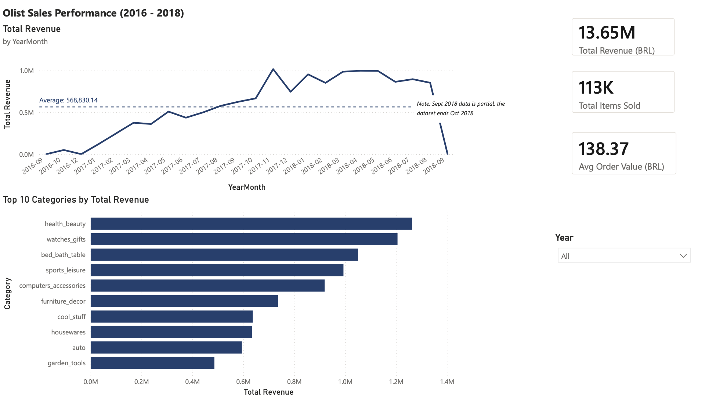
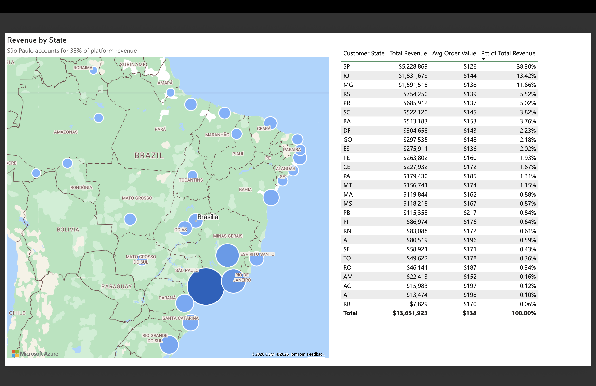
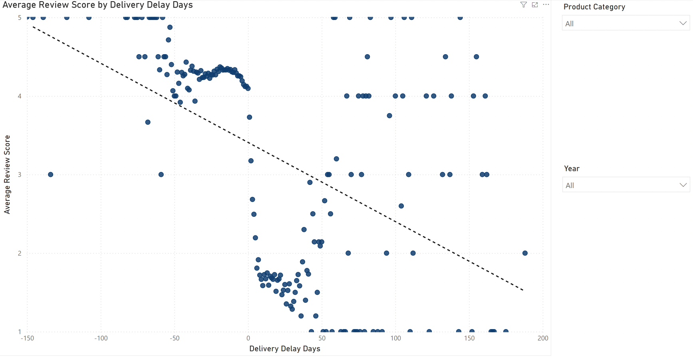
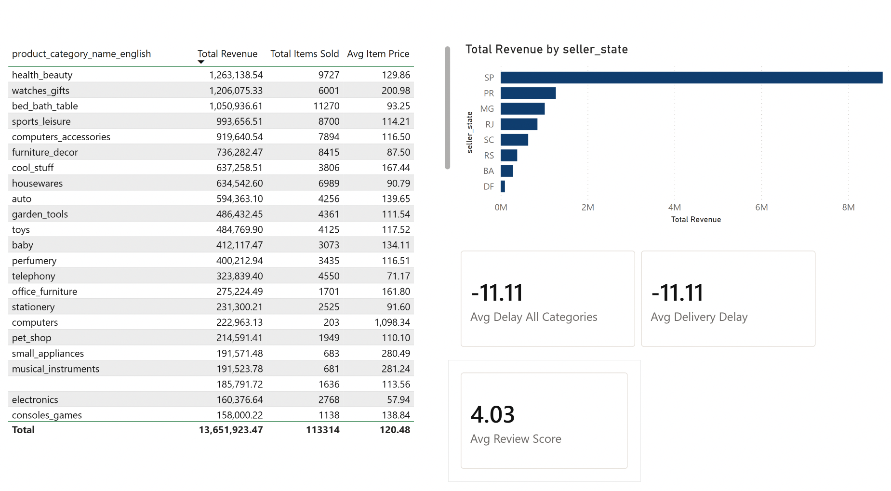

# Olist E-Commerce Sales Analysis: Power BI Portfolio Project

**Author:** Karen Wu 
**Date:** June 29, 2026

## Overview
Analyzing ~100K Brazilian e-commerce orders (2016–2018) across the Olist 
marketplace to understand sales trends, geographic concentration and the 
relationship between delivery performance and customer satisfaction. The 
central business question: which operational factors most meaningfully 
predict customer review score and is delivery timing actually the lever 
it appears to be once price and freight cost are controlled for?

## Data Source
Olist Brazilian E-Commerce Public Dataset (Kaggle): 9 relational CSVs, 
~100K orders across 2016–2018.  
[Kaggle dataset](https://www.kaggle.com/datasets/olistbr/brazilian-ecommerce)

## Star Schema

Fact table: `order_items` (line-item grain, one row per product per order). 
Dimensions: `orders`, `customers`, `products`, `sellers`, `geolocation`, 
and an explicit `DateTable` marked for time intelligence.

Two deliberate grain decisions worth noting: the `order_payments` table was 
collapsed to one row per order via Group By (summing payment value, taking 
max installments) before loading, since payment-method detail wasn't needed 
for this analysis and preserving the raw grain would have required a 
many-to-many relationship. The `geolocation` table was similarly aggregated 
to one row per zip prefix (averaging lat/lng) to resolve duplicate keys and 
enable a clean one-to-many join to the customers dimension.

`review_score` and `delivery_delay_days`, originally on separate tables, 
were denormalized onto `order_items` via Left Outer merges in Power Query. 
This was a deliberate modeling decision and not a shortcut: category filters 
originate on the `products` dimension and flow into `order_items` via a 
single-direction relationship. Keeping these metrics on downstream tables 
(orders, reviews) meant the category filter died at the relationship 
boundary and the measures returned static values regardless of visual 
context. Bringing them onto the fact table resolved this cleanly and is 
consistent with star schema convention; the fact table should carry 
everything that needs to be sliced by dimensions.

## Findings

Sao Paulo dominates platform revenue, accounting for the largest share of 
both seller supply and customer demand; a geographic concentration that 
likely reflects broader Brazilian e-commerce infrastructure rather than 
Olist-specific factors.

Delivery timing is the strongest predictor of customer satisfaction in the 
data. Orders delivered late average 2.26 stars vs. 4.21 stars for on-time 
orders (Welch's t-test, p < 0.001, Cohen's d = 1.38; a large practical 
effect).

Product category explains a statistically significant but small share of 
review score variance (ANOVA F = 14.80, p < 0.001, eta_squared = 0.009); category 
membership accounts for less than 1% of variation in ratings, suggesting 
that satisfaction is driven more by operational execution than by what 
was purchased.

## Python Analysis
See [`notebooks/item_level_analysis.ipynb`](notebooks/item_level_analysis.ipynb)
for the full statistical analysis underpinning the dashboard findings.
The notebook covers:
- Distribution and outlier analysis (price, review score, delivery delay)
- Pearson correlation and heatmap across numeric features
- Welch's t-test with Cohen's d (late vs. on-time delivery)
- One-way ANOVA with eta-squared effect size (review score by category)
- OLS multiple linear regression with interpretation notes

## Report Pages
| Page | Screenshot |
|---|---|
| Sales Overview |  |
| Geography |  |
| Delivery & Satisfaction |  |
| Category Detail (drillthrough) |  |

## Tools
Power BI Desktop, Power Query (M), DAX, Power BI Service (publish + RLS),  
Python (pandas, statsmodels, scipy) for statistical analysis at the item level.

## Limitations

- **Geolocation grain:** customer and seller locations are mapped to 
  zip-code prefix centroids (averaged lat/lng across multiple samples per 
  prefix) rather than precise addresses. Sufficient for state-level 
  geographic analysis; not suitable for sub-city precision.
- **Review score as a proxy:** a boolean "returned next day/week" would be 
  a stronger retention metric than review score, which is optional, 
  self-selected and submitted by fewer than 80% of customers.
- **Static dataset:** Olist data covers 2016–2018 only. Findings reflect 
  Brazilian e-commerce patterns from that period and may not generalize 
  to current market conditions.
- **OLS on ordinal outcome:** review score is a 1–5 discrete scale.
  Ordered logistic regression would be more statistically appropriate,
  though OLS coefficient estimates are directionally reliable at this
  sample size.
